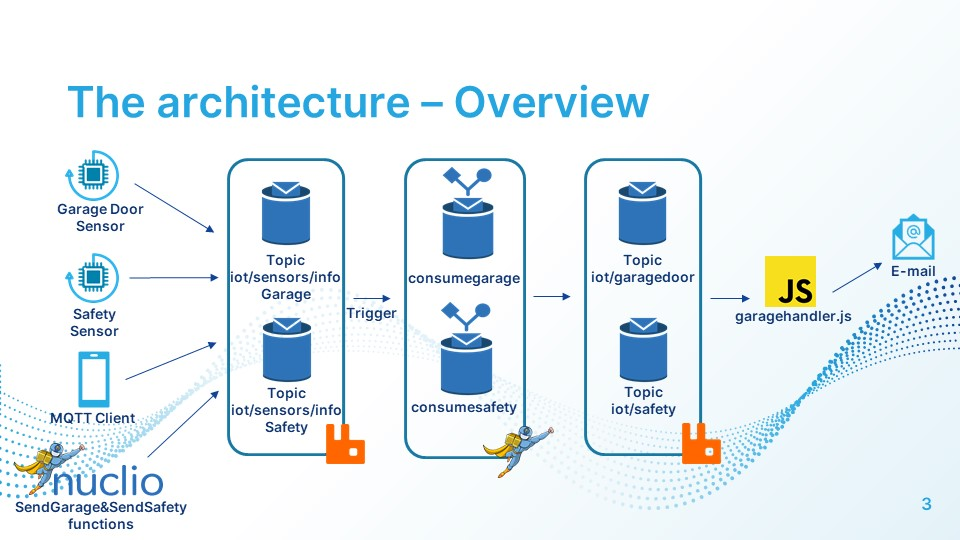

# **Garage Handler**
Project for the exam **Serverless Computing for IoT**.

- Author: **Simona Pentangelo**
- Identification number: **0522501017** 
___
## Summary
- [**Garage Handler**](#garage-handler)
  - [Summary](#summary)
  - [Introduction](#introduction)
  - [Architecture](#architecture)
  - [Project Structure](#project-structure)
  - [Getting Started](#getting-started)
___
## Introduction
This project simulates a garage handler that, on user's request, notifies the current state of a garage door and proceedes, if possible, to open or close it from remote.
___
## Architecture
As previously mentioned, one of the phases of the project is to simulate the sending of data by an IoT sensor (in this case, two sensors: one for safety measures, the other to know the current state of the garage door).  
In this project, this can be done in two ways:

- using the functions '**_sendsafety_**' and '**_sendgarage_**' on Nuclio;
- using a MQTT client from your smartphone:
  - iOS: [EasyMQTT](https://apps.apple.com/it/app/easymqtt/id1523099606)
  - Android: [MQTT Dash (IoT, Smart home)](https://play.google.com/store/apps/details?id=net.routix.mqttdash)

The data are two integer value **between 0 and 1** that indicate the **state of the door** and **the presence/absence of an obstacle** in the pot. These values are published in '**iot/sensors/infoGarage**' and '**iot/sensors/infoSafety**' of **RabbitMQ**.

When a value is published in this queue, the functions **_consumegarage_** and **_consumesafety_** are triggered.These functions publish a new message in each queue '**_iot/garagedoor_**' and '**_iot/safety_**'

At this point, inside **garagehandler.js** the publication in each queue are intercepted and a message is sent to the user via e-mail.
___
## Project Structure
 
- src/
  - _**garagehandler.js**_: takes care of communication via e-mail.
- yaml_functions/
  - _**sendrgarage.yaml**_: takes care of sending a random value to the queue **iot/sensors/ginfoGarage**.
  - _**consumegarage.yaml**_: takes care of the data published on the topic.
  - _**sendrsafety.yaml**_: takes care of sending a random value to the queue **iot/sensors/infoSafety**
  - _**consumesafety.yaml**_: takes care of the data published on the topic.
- **.env**: file containing settings for javascript scripts.
___
## Getting Started
To run this project, [Node.js](https://nodejs.org/) and [Docker](https://www.docker.com/products/docker-desktop) are required.

From **two different** terminals, start the docker to run RabbitMQ and Nuclio with these following commands:

- **Docker RabbitMQ**:

  ```sh
  docker run -p 9000:15672  -p 1883:1883 -p 5672:5672  cyrilix/rabbitmq-mqtt
  ```
  
- **Docker Nuclio**:

  ```sh
  docker run -p 8070:8070 -v /var/run/docker.sock:/var/run/docker.sock -v /tmp:/tmp nuclio/dashboard:stable-amd64
  ```
  
- **Update and deploy Functions**:

  - Type '**localhost:8070**' on your browser to open the homepage of Nuclio;
  - Create new project and call it '_GarageHandler_';
  - Press '**Create function**', '**Import**' and upload the four functions that are in the **yaml_functions** folder;
  - In both, **change the already present IP with your IP**;  
    **!!!Don't forget the triggers!!!**
  - Press **'Deploy'**.  
    
- **Modification to the Javascript file**:

  Open the **.env** file and insert your **IP address** instead of '_INSERT_YOUR_IP_'.

  Open the **garagehandler.js** and change the reciever in the function _**sendMsg**_ from '_INSERT_YOUR_EMAIL_' to your e-mail.

  Open **two more** terminals and type, from the **root of the project**, on the first:

  ```sh
  npm install
  node src/garagehandler.js
  ```
After all these steps, you are able to send a value using both **sendgarage**/**sendsafety** on Nuclio and an **MQTT client** from your smartphone.


